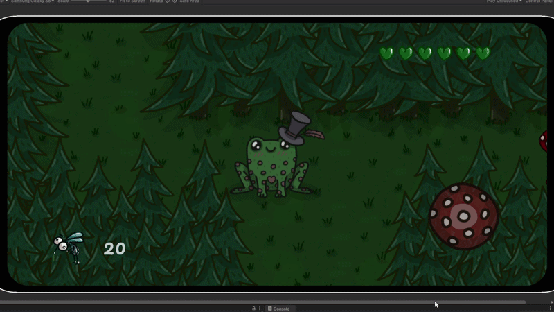
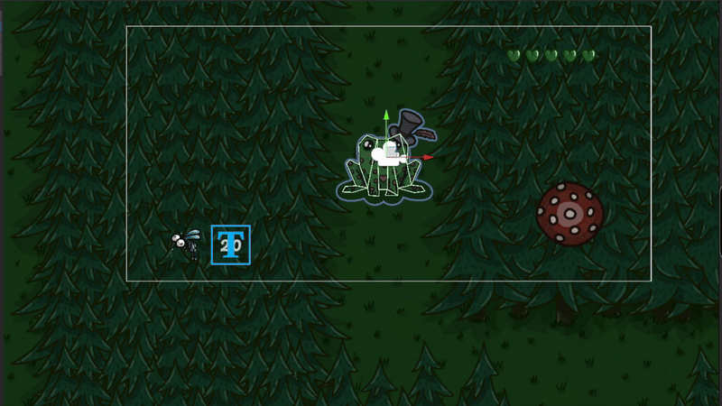
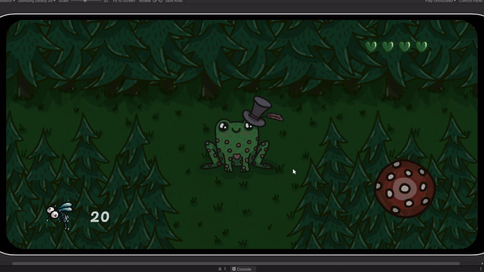
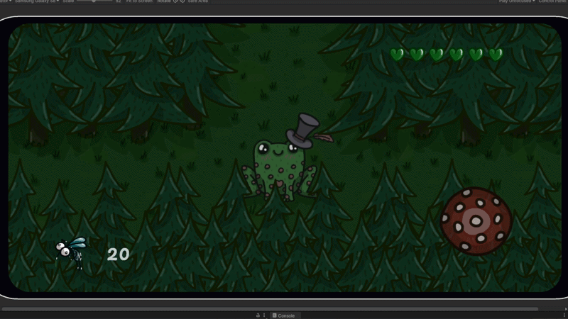
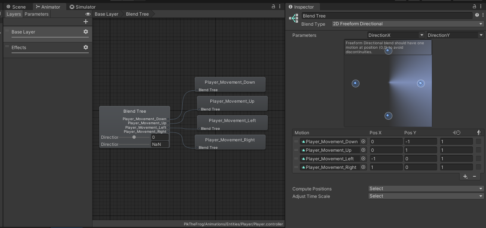
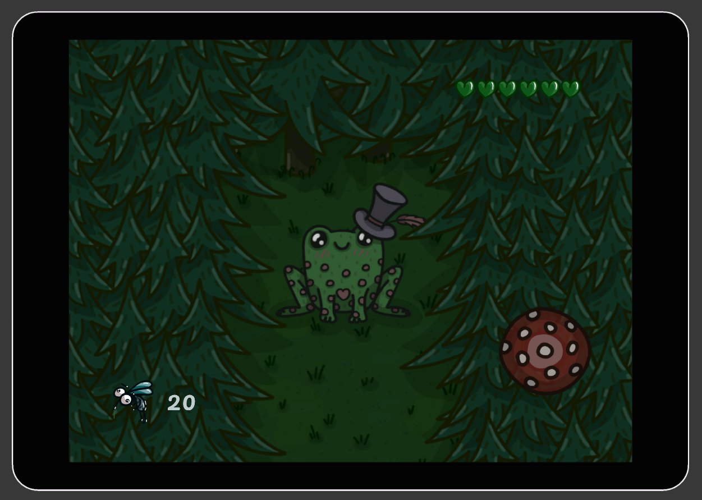
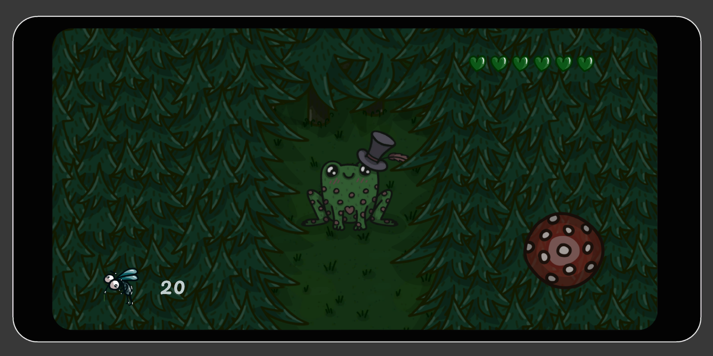
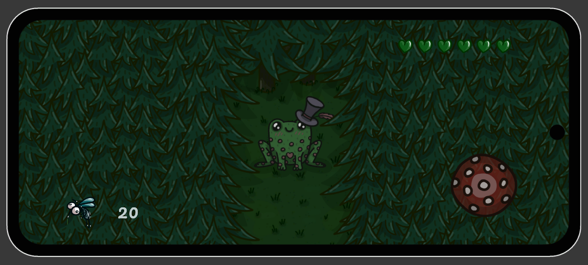
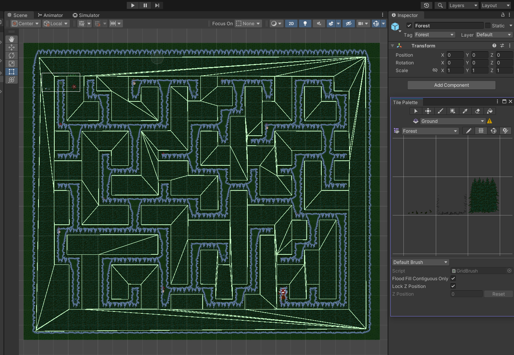

# Pik The Frog
## 2D Top-Down Arcade Prototype (Android)
___
### Overview
Pik The Frog is a 2D top-down arcade gameplay prototype developed for mobile devices (currently configured for Android).

The project represents a vertical slice of a mobile game, featuring adaptive UI, layered animation system, modular enemy behaviour system, and limited-visibility mechanics designed to create tension-driven gameplay.

The focus of the project is to demonstrate gameplay architecture, modular systems, and expandable core mechanics.
___
### Tech Stack
* Engine: Unity
* Language: C#
* Platform: Mobile devices (Android)
* Architecture: Interface-driven modular component design
* Physics: Rigidbody2D & collision system
* Animation: Blend Trees + Animator Layers
* UI: UGUI + TextMeshPro
* Input: New Input System
* Level Design: Tilemaps
* Data Configuration: ScriptableObjects
* Version Control: Git
___
### Gameplay Overview
The player controls a frog navigating through a maze to reach the frog’s home.

But to complete the level, the player must:

1. Explore the maze with limited visibility (only nearby walls are visible).
2. Collect all 20 mosquitoes placed across different parts of the maze.
3. Avoid enemies with unique status effects.
4. Survive enemy encounters and prevent health from reaching zero.
5. Reach the goal only after collecting all required items (mosquitoes).
___
## Core Gameplay Mechanics
___
### Player Mechanics
* Physics-based movement driven by the New Input System
* Temporary invulnerability window after taking damage (3 seconds)
* Speed scales proportionally to joystick input magnitude
* Dynamic collider shape adjustment aligned with character visuals

___
### Enemy Mechanics & Types
* Autonomous physics-based movement
* Automatic direction change on collision with environment colliders
* Physics-based collision detection to apply damage and status effects to the player

#### 🔴 Red Mushroom
- No visual effect
- Deals increased damage (2 HP instead of 1)

#### 🟢 Green Mushroom
- Applies "Poison" effect (6 seconds)
- Deals 1 HP damage

#### 🟣 Purple Mushroom
- Applies "Blindness" effect (6 seconds)
- Deals 1 HP damage

The enemy without visual status effects intentionally deals increased damage to maintain gameplay balance.
___

### Animation System

Player animations are implemented using Blend Trees driven directly by input values.

This ensures:

- Clean animator graph
- No state explosion
- Predictable transitions

Player animations are separated into dedicated Animator Layers for base states and visual effects, improving scalability, clarity, and future extensibility.

___
### UI System
The project includes a mobile-adaptive HUD system designed for various Android screen sizes and aspect ratios.     
The layout was tested using Unity Device Simulator to validate behavior across multiple device resolutions.

___
### Environment System
The environment is built using Unity Tilemaps, combined with a collider and tagging system to define gameplay interactions.

The maze layout is constructed through Tilemap grids. This setup keeps environmental logic simple, scalable, and designer-friendly.

___
## Architectural Overview
___

The project follows a modular Unity component-based architecture, where gameplay systems are composed through loosely coupled components and interfaces.

Core gameplay systems are abstracted via interfaces and connected through serialized references, enabling loose coupling. This allows decoupled communication between gameplay actors, UI, and level systems while keeping scene setup designer-friendly.

The structure prioritizes clarity and rapid prototyping while maintaining separation of responsibilities across gameplay, services, and presentation layers.

___

### Core Systems

- Player System - movement, animation, damage handling, temporary invulnerability
- Enemy System - modular enemy behaviours with movement and attack components
- Input System - New Input System abstraction via `IInputProvider`
- Collection System - event-driven collectible tracking
- UI System - reactive updates via health & collection events
- Level State System - win condition & goal unlocking
- Camera System - player-follow observer pattern

___

### Player System

`Player` is implemented as a facade coordinating movement, animation, damage handling, and UI communication.

Movement is processed in `FixedUpdate` via `IInputProvider`, while animation updates are delegated to `PlayerAnimator`.

The system supports temporary invulnerability by disabling enemy collisions after damage.

Dependencies include level loading, UI updates, and visual effects services.

___

### Enemy System

All enemies inherit from a common `EnemyBase` class encapsulating movement, collision handling, and attack logic.

Behaviour modules (movement, attack) are composed via interfaces instead of deep inheritance hierarchies.   
This allows adding new enemy archetypes without modifying core logic.

___

### Event-Driven Systems

Collection and level progression systems use event-driven communication.

`ItemManager` broadcasts collection progress and completion events, which are consumed by UI and level state systems to update HUD and unlock the goal respectively.

___

### How To Run

1. Clone the repository
2. Open the project via Unity Hub
3. Use the recommended Unity version: 2022.3.58f1
4. Open the Level_0 scene
5. Run in Editor or build for Android

___
### Author: JuliaSABEL

Unity Gameplay Developer (Junior+)

Email: sabelnikova.j.partner@gmail.com  
LinkedIn: www.linkedin.com/in/julia-sabelnikova                                                                                                                                                                            
Telegram: https://t.me/S_Julia_A_06 
